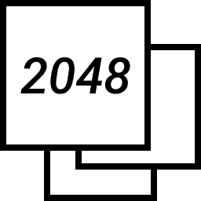

# 2048

[English](README.md) &bull; [Russian](README-RU.md)

Моя собственная реализация [игры 2048](https://ru.wikipedia.org/wiki/2048_(%D0%B8%D0%B3%D1%80%D0%B0)) с минималистичным интерфейсом и прочими интересными фишками.

> [!WARNING]
> Код игры был написан мной с нуля и не основан на оригинальном исходном коде игры. В связи с этим эта игра может работать совсем не так, как того ожидает пользователь).

## Установка

Загрузите архив исходного кода [последнего выпуска](https://github.com/ivan-movchan/2048/releases/latest) и распакуйте в любом удобном месте.

Игра должна хорошо работать в любом современном веб-браузере с включённым JavaScript. Рекомендуемая минимальная высота окна веб-браузера&nbsp;&mdash; `640` пикселей.

## Участие в проекте

Обратная связь и любые вклады в проект приветствуются. Сообщайте об ошибках и предлагайте идеи на странице ["Issues"](https://github.com/ivan-movchan/2048/issues) или связавшись с разработчиком лично. Вы также можете форкнуть репозиторий, внести правки и отправить запрос на вытягивание.

## Титры

- Идея и разработка: [Иван Мовчан](https://github.com/ivan-movchan).

## Лицензия

[MIT License](LICENSE)